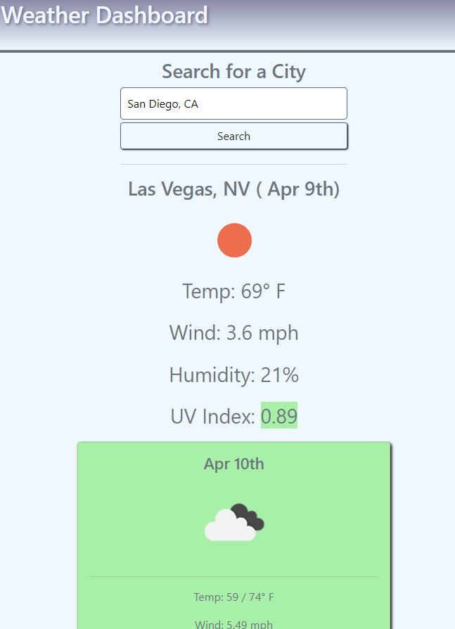

# Weather Dashboard
(*P*)

## Summary

Web App reliant on third party API, openweathermap, to display current and five-day weather conditions for a city of the user's choice.

## details

- Displays: Dates, Wind Speeds, Temperatures, Humidity, UV indexes
- UVI color coded for severity
- Future forecast days are color coded for weather severity
- Past Searches are saved in local storage and displayed in the sidebar as buttons that can be clicked for a quick search.
- Bootstrap and jQuery employed.
- Media Queries make display responsive.

## Screenshot

## Live Site

https://joechristianson.github.io/WeatherDashboard/